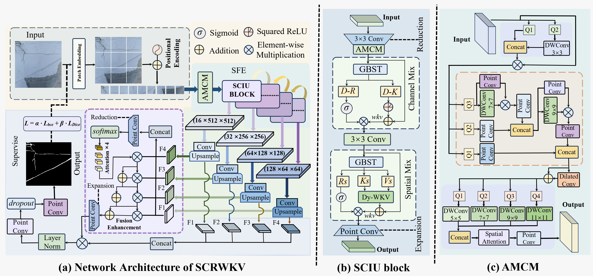

<h1 align="center">SCRWKV</h1>

<!-- <div align="center">
  
</div> -->

<h3 align="center">
[ICML 2026] SCRWKV: Ultra-Compact Structure-Calibrated Vision-RWKV for Topological Crack Segmentation
</h3>

<p align="center">
  🖐😭🤚 🌟 If this work is useful to you, please give this repository a Star! 🌟 🖐😭🤚
</p>

<p align="center">
  <a href="https://arxiv.org/abs/你的arxiv编号">
    
  </a>
  <!-- <a href="你的论文链接">
    
  </a> -->
  <a href="LICENSE">
    
  </a>
  <!-- <a href="https://github.com/zhxhzy/SCRWKV">
    
  </a> -->
</p>

---

## 📜 News

- **2026-05-01:** 🎉 We are delighted to announce that our paper has been accepted by **ICML 2026**! 🖐😭🤚
- **2026-XX-XX:** 📦 The code has been publicly released.
- **2026-XX-XX:** 📝 The preprint has been posted on arXiv.

---

## 🔥 Overview


<div align="center">
    
</div>


Achieving pixel-level accurate segmentation of structural cracks across diverse scenarios remains a formidable challenge. Existing methods face significant bottlenecks in balancing crack topology modeling with computational efficiency, often failing to reconcile high segmentation quality with low resource demands. To address these limitations, we propose the Ultra-Compact Structure-Calibrated Vision RWKV (SCRWKV), a network that achieves high-precision modeling via a novel Structure-Field Encoder (SFE) backbone while maintaining linear complexity. The SFE integrates the Adaptive Multi-scale Cascaded Modulator (AMCM) to enhance texture representation and utilizes the Structure-Calibrated Insight Unit (SCIU) as its core engine. Specifically, the SCIU employs the Geometry-guided Bidirectional Structure Transform (GBST) to capture topological correlations and integrates the Dynamic Self-Calibrating Decay (DSCD) into Dy-WKV to suppress noise propagation. Furthermore, we introduce a lightweight Cross-Scale Harmonic Fusion (CSHF) decoder to achieve precise feature aggregation. Systematic evaluations on multiple benchmarks characterized by complex textures and severe interference demonstrate that SCRWKV, with only 1.22M parameters, significantly outperforms SOTA methods. Achieving an F1 score of 0.8428 and mIoU of 0.8512, the model confirms its robust potential for efficient real-world deployment.

## 🛠️ Installation

Create the environment:


```bash
conda create -n scrwkv python=3.9 -y
conda activate scrwkv
pip install torch==2.1.2 torchvision==0.16.2 torchaudio==2.1.2 
pip install -U openmim
mim install mmcv-full==1.7.2
```
Simply install the required dependencies according to the project requirements.


---

## 📁 Dataset Preparation

Please create a new `data/` directory to store the datasets.

The expected dataset structure is:

- `data/`
  - `dataset_name_1/`

  - `dataset_name_2/`

You may need to modify the dataset path in the configuration or training script before running experiments.

---

## 🚀 Training

You can modify the parameters in the main.py file and run it with the following command:

```bash
python main.py
```

You can also specify your own arguments, for example:

```bash
python main.py \
  --dataset your_dataset \
  --
```

Please modify the command according to the arguments defined in `main.py`.

---

## 📊 Evaluation

You can also use checkpoints for inference with the following command:

```bash
python test.py
```

Compute evaluation metrics with:

```bash
python eval_compute.py
```

The evaluation-related files are located in the `eval/` directory.

The results will be saved in the `results/` directory.

---


## 🌍 Real-world Deployment

<div align="center">
  
</div>

---

## 🖼️ Visualization

Some qualitative visualization results are shown below.

<div align="center">
    
</div>

Visual comparison of typical crack segmentation results on the TUT dataset against 10 SOTA methods. Red boxes highlight
critical details, and green boxes mark misidentified regions.


---

### 🏗️ Quantitative Results

Comparison with 10 state-of-the-art methods across 4 datasets.

#### 🟢 Part 1: Crack500 & DeepCrack
| Method | C500 ODS | C500 OIS | C500 P | C500 R | C500 F1 | C500 mIoU | DC ODS | DC OIS | DC P | DC R | DC F1 | DC mIoU |
| :--- | :---: | :---: | :---: | :---: | :---: | :---: | :---: | :---: | :---: | :---: | :---: | :---: |
| RIND | 0.6469 | 0.6483 | 0.6998 | 0.7245 | 0.7119 | 0.7381 | 0.8087 | 0.8267 | 0.7896 | 0.8920 | 0.8377 | 0.8391 |
| SFIAN | 0.6977 | 0.7348 | 0.6983 | 0.7742 | 0.7343 | 0.7604 | 0.8616 | 0.8928 | 0.8549 | 0.8692 | 0.8620 | 0.8776 |
| CTCrackSeg | 0.6941 | 0.7059 | 0.6940 | 0.7748 | 0.7322 | 0.7591 | 0.8819 | 0.8904 | 0.9011 | 0.8895 | 0.8952 | 0.8925 |
| DTrCNet | 0.7012 | 0.7241 | 0.6527 | 0.8280 | 0.7357 | 0.7627 | 0.8473 | 0.8512 | 0.8905 | 0.8251 | 0.8566 | 0.8661 |
| Crackmer | 0.6933 | 0.7097 | 0.6985 | 0.7572 | 0.7267 | 0.7591 | 0.8712 | 0.8785 | 0.8946 | 0.8783 | 0.8864 | 0.8844 |
| SimCrack | 0.7127 | 0.7308 | 0.7093 | 0.7984 | 0.7516 | 0.7715 | 0.8570 | 0.8722 | 0.8984 | 0.8549 | 0.8761 | 0.8744 |
| MambaIR | 0.7043 | 0.7189 | 0.7204 | 0.7681 | 0.7435 | 0.7663 | 0.8796 | 0.8840 | 0.9056 | 0.8895 | 0.8975 | 0.8907 |
| CSMamba | 0.6931 | 0.7162 | 0.6858 | 0.7823 | 0.7315 | 0.7592 | 0.8738 | 0.8766 | 0.9025 | 0.8863 | 0.8943 | 0.8863 |
| PlainMamba | 0.7035 | 0.7173 | 0.7170 | 0.7557 | 0.7358 | 0.7682 | 0.8646 | 0.8668 | 0.9050 | 0.8659 | 0.8850 | 0.8788 |
| SCSegamba | 0.7244 | 0.7370 | 0.7270 | 0.7859 | 0.7553 | 0.7778 | 0.8938 | 0.8990 | 0.9097 | 0.9124 | 0.9110 | 0.9022 |
| SCRWKV (Ours) | 0.7256 | 0.7447 | 0.7013 | 0.8180 | 0.7552 | 0.7787 | 0.9254 | 0.9307 | 0.9211 | 0.9520 | 0.9363 | 0.9289 |

---

#### 🔵 Part 2: CrackMap & TUT
| Method | Map ODS | Map OIS | Map P | Map R | Map F1 | Map mIoU | TUT ODS | TUT OIS | TUT P | TUT R | TUT F1 | TUT mIoU |
| :--- | :---: | :---: | :---: | :---: | :---: | :---: | :---: | :---: | :---: | :---: | :---: | :---: |
| RIND | 0.6745 | 0.6943 | 0.6023 | 0.7586 | 0.6699 | 0.7425 | 0.7531 | 0.7891 | 0.7872 | 0.7665 | 0.7767 | 0.8051 |
| SFIAN | 0.7200 | 0.7465 | 0.6715 | 0.7668 | 0.7160 | 0.7748 | 0.7290 | 0.7513 | 0.7715 | 0.7367 | 0.7537 | 0.7896 |
| CTCrackSeg | 0.7289 | 0.7373 | 0.6911 | 0.7669 | 0.7270 | 0.7785 | 0.7940 | 0.7996 | 0.8202 | 0.8195 | 0.8199 | 0.8301 |
| DTrCNet | 0.7328 | 0.7413 | 0.6912 | 0.7681 | 0.7276 | 0.7812 | 0.7987 | 0.8073 | 0.7972 | 0.8441 | 0.8202 | 0.8331 |
| Crackmer | 0.7395 | 0.7437 | 0.7229 | 0.7467 | 0.7346 | 0.7860 | 0.7429 | 0.7640 | 0.7501 | 0.7656 | 0.7578 | 0.7966 |
| SimCrack | 0.7559 | 0.7625 | 0.7380 | 0.7672 | 0.7523 | 0.7963 | 0.7984 | 0.8090 | 0.8051 | 0.8371 | 0.8208 | 0.8334 |
| MambaIR | 0.7332 | 0.7347 | 0.7569 | 0.7013 | 0.7280 | 0.7834 | 0.7861 | 0.7930 | 0.7877 | 0.8387 | 0.8125 | 0.8249 |
| CSMamba | 0.7371 | 0.7413 | 0.7053 | 0.7663 | 0.7346 | 0.7841 | 0.7879 | 0.7946 | 0.7947 | 0.8353 | 0.8146 | 0.8263 |
| PlainMamba | 0.7150 | 0.7189 | 0.6649 | 0.7616 | 0.7099 | 0.7699 | 0.7867 | 0.7967 | 0.7701 | 0.8523 | 0.8102 | 0.8253 |
| SCSegamba | 0.7741 | 0.7766 | 0.7629 | 0.7727 | 0.7678 | 0.8094 | 0.8204 | 0.8255 | 0.8241 | 0.8545 | 0.8390 | 0.8479 |
| SCRWKV (Ours) | 0.7756 | 0.7811 | 0.7655 | 0.7826 | 0.7740 | 0.8106 | 0.8245 | 0.8313 | 0.8213 | 0.8655 | 0.8428 | 0.8512 |

## 📜 Citation

If you find this work useful, please cite our paper:

```bibtex
@inproceedings{scrwkv2026,
  title={SCRWKV: Ultra-Compact Structure-Calibrated Vision-RWKV for Topological Crack Segmentation},
  author={Author A and Author B and Author C},
  booktitle={International Conference on Machine Learning},
  year={2026}
}
```

---

## 📄 License

This project is released under the Apache 2.0 License.

Please see the [LICENSE](LICENSE) file for more details.

---

## 🙏 Acknowledgements

This work stands on the shoulders of the following open-source projects, and we sincerely thank their authors for making it possible:

* [SCSegamba](https://github.com/Karl1109/SCSegamba) 
* [Vision-RWKV](https://github.com/OpenGVLab/Vision-RWKV) 
* [DeepCrack](https://github.com/yhlleo/DeepCrack) 
* [mmclassification](https://github.com/open-mmlab/mmclassification)
---


## 📟 Contact

If you have any other questions, feel free to contact me at [zhanghanxu@stud.tjut.edu.cn](mailto:zhanghanxu@stud.tjut.edu.cn).
